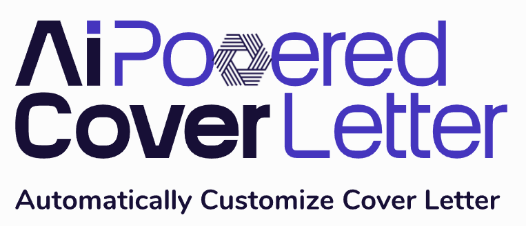

### AI-Powered Automatically Customize Cover Letter for Each Job Post
> - AI-Powered, Customized, Cover Letters
> - AI Assistant Job Flow Automator. 
> - Automate the customization of cover letters tailored to your resume and the unique requirements outlined in the job description extracted.

<div align="center">

<a href='https://www.hypech.com'>
</img></a>
<br></br>

[](https://www.python.org)
[](https://jupyterlab.readthedocs.io/en/stable)
[](https://www.tensorflow.org)
[](https://github.com/pre-commit/pre-commit)
[](https://github.com/psf/black)
[](http://mypy-lang.org/)
[](http://www.pydocstyle.org/en/stable/)
[](https://www.gnu.org/licenses/gpl-3.0)
[](https://github.com/aiXpertLab/AI-Powered-Automatically-Customize-Cover-Letter/releases)
[](https://github.com/aixpertlab/)
 
[?style=for-the-badge>)](https://hypech.com)

[](https://www.linkedin.com/in/aiXpert)
[](https://twitter.com/aiXpertLab)
[](https://www.youtube.com/@aiXpertLab)
[](https://www.facebook.com/aiXpertLab/)
[](https://gmail.com)

</div> 

The AI-powered solution enables customers to integrate their specialized knowledge with OpenAI models to automate the extraction of relevant information from websites of their interest, effectively training the AI to deliver tailored results as if it were trained on their unique dataset.

- [GPT-4 from OpenAI](#architecture)
- [Powered by Python](#architecture)
- [Intuitive User Interface](#architecture)

You will get Unlock Your Personalized AI Assistant Effortlessly: Scrape, Upload, and Go.

> [!WARNING]  
> **Website Scraping Policy**
> 
> This project utilizes web scraping techniques to gather data from various websites. It's important to note that not all websites allow scraping, and some may have strict policies against it.
>
> **Before using this project**
>
> Take the time to carefully read and understand the scraping policies of each website from which you intend to scrape data. These policies can usually be found in the website's terms of service or robots.txt file.
>
> **Comply with Policies** 
>
>Ensure that you comply with the scraping policies of each website. Violating these policies could lead to consequences such as account restrictions, IP bans, or legal action.

> [!NOTE] 
> **Disclaimer**
> 
>This project is provided for general-purpose use, and we do not take responsibility for any consequences resulting from the misuse of web scraping techniques. Users are solely responsible for ensuring compliance with website scraping policies and any associated risks.

# Overview

There's a saying that goes, 'the job hunt is a job in itself.' Indeed, a significant amount of energy and time is often spent tailoring cover letters to match each job application. With the assistance of an AI, we can automate this process, drastically reducing the time it takes to prepare a cover letter to just a few seconds with a simple process of Scraping, Clicking, and Sending. Not only will your cover letter be fully customized, but it will also maintain a professional tone. Sounds promising, doesn't it? That's because it truly is.

"Welcome to AI-Powered Job Assistance! Our innovative platform automatically tailors cover letters by scraping job descriptions and seamlessly integrating them with your resume. Review before sending and find your perfect fit with ease. Your dream job awaits!"

# Technology Stack

1. OpenAI Assistant ChatGPT
2. Python
3. Selenium WebDriver

Selenium will facilitate various tasks such as navigating between pages, completing forms (e.g., login credentials), clicking links, and scrolling down. Apart from data scraping, Selenium will be instrumental in automating the outlined steps to manage actions until accessing the pages for data extraction. We will extract job offers and job descriptions.

Utilizing ChatGPT, known for its professional assistance, and leveraging your own resume as a knowledge base, ChatGPT will generate tailored resumes.

Python serves as the intermediary connecting the website, ChatGPT, and your personal information. Tkinter GUI is employed to provide a user-friendly interface.

# Quick start

1. Python 3.12.2
2. Selenium & chromedriver installed (watch how in this one).
https://chromedriver.chromium.org/

## Requirements

- `python-dotenv`
- `openai`
- `selenium`

------------------Video Instruction---------------------

[Yourtube](https://youtu.be/TlnytEi2lD8?si=jfcDj2MZqBptziZc)

```bash
pip install -r requirements.txt
```

[https://github.com/noBaldAaa](https://github.com/noBaldAaa/find-job)https://github.com/noBaldAaa/find-job

https://github.com/LouisCaixuran/auto_job_find_azure


You can check my medium post where I have analyzed the d

https://selenium-python.readthedocs.io/


> [!NOTE]  
> Highlights information that users should take into account, even when skimming.

> [!TIP]
> Optional information to help a user be more successful.

> [!IMPORTANT]  
> Crucial information necessary for users to succeed.

> [!CAUTION]
> Negative potential consequences of an action.
